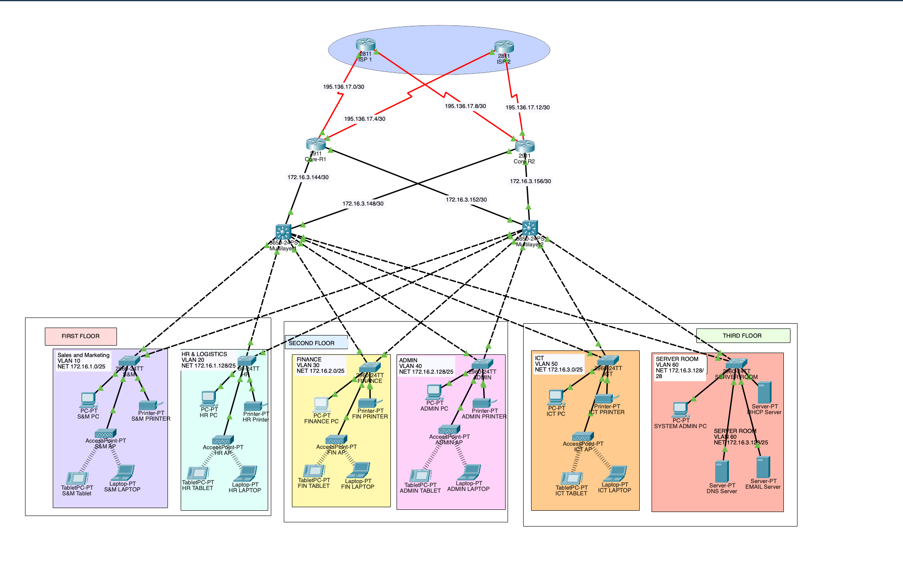

#  Enterprise Networking Project (Cisco Packet Tracer)

##  Overview
This project demonstrates the **design and implementation of an Enterprise Network** using Cisco Packet Tracer.  
It follows a **Hierarchical Network Design model** (Core, Distribution, and Access layers) and implements multiple enterprise-grade technologies.

## Technologies Implemented
- Hierarchical Network Design (Core / Distribution / Access layers)
- VLANs and Inter-VLAN Routing (using Switch Virtual Interfaces - SVI)
- DHCP Server for dynamic IP allocation
- Port Security on Switches
- Secure remote management using SSH
- NAT Overload (PAT) for Internet access
- Access Control Lists (ACLs) for traffic filtering
- Wireless LAN (WLAN) with Access Point configuration
- Static IPv4 addressing and host configurations

##  Requirements
- Cisco Packet Tracer (Version 8.x or higher recommended)
- Basic to intermediate knowledge of networking concepts (VLANs, routing, ACLs, DHCP, etc.)

##  How to Run
1. Clone this repository:
   ```bash
   git clone https://github.com/rchethana-19/Enterprise-CPT.git
2. Review the .pkt file

##  Network diagram

